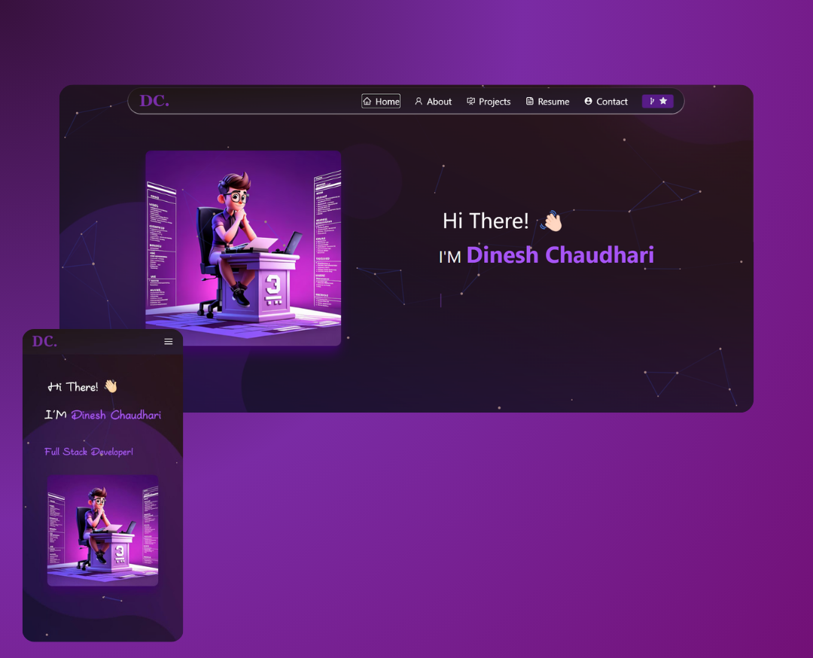

<h2 align="center">
  Portfolio Website - v1.0 
  <a href="https://github.com/Dinesh99673/Portfolio" target="_blank">Dinesh99673</a>
</h2>

  

 
 
<h3 align="center">
    🔹
    <a href="https://github.com/Dinesh99673/Portfolio/issues">Report Bug</a> &nbsp; &nbsp;
    🔹
    <a href="https://github.com/Dinesh99673/Portfolio/issues">Request Feature</a>
</h3>

## TL;DR

You can fork this repo to modify and make changes of your own. Please give me proper credit by linking back to [Dinesh](https://github.com/Dinesh99673/Portfolio). Thanks!

## Built With

My personal portfolio <a href="https://dinesh-portfolio-gilt.vercel.app/" target="_blank">Dinesh99673</a> which features some of my github projects as well as my resume and technical skills. 

This project was built using these technologies.

- React.js
- TailwindCSS
- VsCode
- Vercel

## Features

**📖 Multi-Page Layout**

**🎨 Styled with React-TailwindCSS and Css with easy to customize colors**

**📱 Fully Responsive**

## Getting Started

Clone down this repository. You will need `node.js` and `git` installed globally on your machine.

## 🛠 Installation and Setup Instructions

1. Installation: `npm install`

2. In the project directory, you can run: `npm run dev`

Runs the app in the development mode.\
Open [http://localhost:5173](http://localhost:5173) to view it in the browser.
The page will reload if you make edits.

## Usage Instructions

Open the project folder and Navigate to `/src/components/`.  
You will find all the components used and you can edit your information accordingly.
